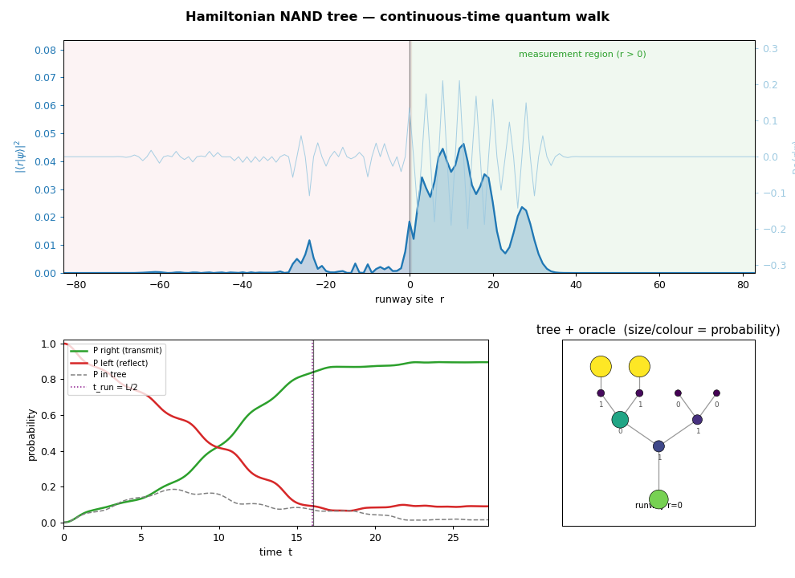
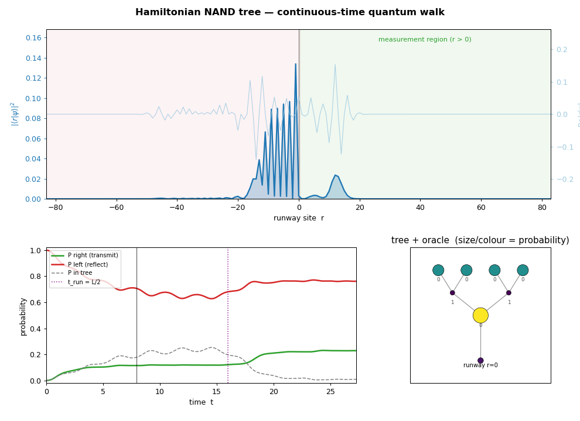

# The Hamiltonian NAND Tree — interactive quantum-walk demo

An interactive animation of the continuous-time quantum walk algorithm of

> E. Farhi, J. Goldstone, S. Gutmann,
> *A Quantum Algorithm for the Hamiltonian NAND Tree*, quant-ph/0702144.

(The paper is included as `quantum_algorithm_nand_tree_paper.pdf`.)

A right-moving wave packet starts on the **left** of a one-dimensional
"runway." It evolves under the walk Hamiltonian `H = -A` (minus the adjacency
matrix of the graph). At runway site `0` the runway is joined to the root of a
binary tree that encodes a NAND-tree instance. The packet **transmits** to the
right if and only if the NAND tree evaluates to **1** (transmission coefficient
`T(0)=1`) and **reflects** if it evaluates to **0** (`T(0)=0`). Measuring the
projector onto the right half of the runway at `t = L/2` reads out the answer.

| NAND = 1 → transmit | NAND = 0 → reflect |
|---|---|
|  |  |

## Run

```bash
pip install -r requirements.txt        # numpy, scipy, matplotlib

python nand_tree_demo.py               # interactive dashboard
python nand_tree_physics.py            # headless self-test (no plotting)
```

The self-test confirms that the quantum measurement `P_right(t_run)` agrees
with a classical bottom-up NAND evaluation for all-0, all-1, and random
instances at several depths.

## What you see

The window has a native control panel on the **left** and the matplotlib plots
on the **right**:

- **Runway panel (top):** `|<r|psi>|^2` versus runway site `r` (blue fill), with
  the oscillating `Re<r|psi>` overlaid (light blue, toggle with *Show wave*).
  The green band is the measurement region `r > 0`; the red band is the
  left/reflect region.
- **Time panel (lower-left):** `P_right` (transmit), `P_left` (reflect) and
  `P_in_tree` versus time. The solid line marks the current time; the dotted
  purple line marks the measurement time `t_run = L/2`.
- **Tree panel (lower-right):** the binary tree plus its oracle nodes near
  runway site `0`. Marker size and colour track each node's probability, so you
  watch the packet enter and scatter off the tree. Small digits are the
  classical 0/1 value carried by each node.
- **Control panel (left):** a **verdict card** — the classical NAND value, the
  predicted `|T(0)|^2`, and the measured `P_right(t_run)` with a ✓/✗ check —
  above a parameters readout and all the controls below.

## Tunable parameters (from the paper)

| Control | Meaning |
|---|---|
| `n` (depth) | tree depth; the tree has `N = 2**n` leaves |
| `L` (packet) | packet length. The paper needs `L >> 16·sqrt(N)` so the packet's energy width `~1/L` sits inside the good-transmission window `|E| < 1/(16·sqrt(N))`. Larger `L` sharpens transmit/reflect contrast — the `L ~ sqrt(N)` run time. |
| `M / L` | runway half-length as a multiple of `L`; the runway runs from `-M` to `M`. `M` must be large enough that nothing reflects off the far wall. |
| `time` | scrub through the precomputed evolution; **Play** animates it. |
| leaf toggles | each leaf's input bit (green = 1 = the leaf is connected to its oracle node). |
| `All 0` / `All 1` / `force NAND=1` / `force NAND=0` | quick instances. |
| `Show wave` | show/hide the light-blue `Re<r|psi>` overlay on the runway. |

Changing `n`, `L`, `M`, or any leaf bit re-runs the simulation; the time
scrubber and **Play** only replay precomputed frames, so playback stays smooth.

## How it works (implementation)

- `nand_tree_physics.py` builds the graph (runway + tree + oracle nodes), the
  sparse Hamiltonian `H = -A`, and the initial packet
  `<r|psi0> = i^r / sqrt(L)` for `-L+1 <= r <= 0` (right-moving, energy-peaked
  at `E = 0`). The whole trajectory `exp(-iHt)|psi0>` is obtained in one call to
  `scipy.sparse.linalg.expm_multiply`. It also evaluates the NAND tree
  classically for the verdict and the `force NAND=*` buttons.
- `nand_tree_demo.py` is the GUI on top of that core, split into `PlotModel`
  (owns the matplotlib figure, the simulation state and all drawing — no Tk
  dependency, so it renders head-less for testing) and `DemoApp` (a native
  Tkinter window with a `ttk` control panel and the figure embedded via
  `FigureCanvasTkAgg`).
